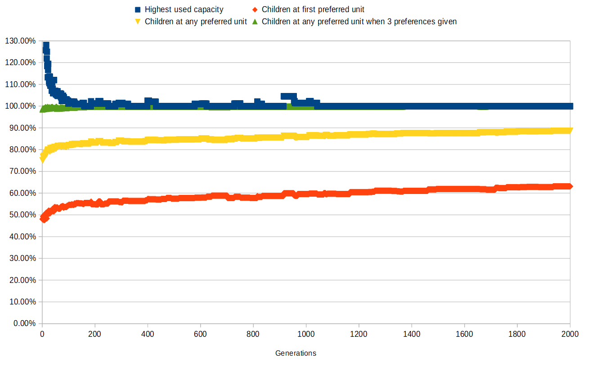

# evaka AI PoC

This PoC will attempt to solve an assignment problem, where children need to be assigned into preschools. 

Each unit has a maximum amount of children it can serve and each child has preferences about the units.

## Test data

### Units

Units are parsed from real data. They are filtered to only include ones that offer preschool and have valid coordinates.
For now units where name contains "esiopetus" or "koulu" are filtered out to avoid duplicate units.

Each unit is assigned a random max capacity between 15 and 50, and random used capacity between 20% and 90% of the
max capacity.

### Children

In test data there are 1500 randomly generated children who have applied for preschool. 

Each child has a capacity requirement. For 75% of them it is 1.0 (applied for preschool and connected daycare), 
for 20% it is 0.5 (preschool only) and for 5% it is 1.5 (assistance need).

Each child has a randomly selected preferred unit. 70% of the children also have a secondary preference (randomly 
selected from the 8 nearest units) and 40% also have a third preference (randomly selected from the 15 nearest 
units). 85% of the children select only finnish speaking units and 10% only swedish speaking units.

## The algorithm

For solving this problem a genetic algorithm was chosen.

### Genetic structure

Each solution candidate is a genome (an ordered list of genes), where each gene represents a child. The gene's value is
an integer between 0 and 4 (inclusive), which represents to which of the child's top 5 preferred units he/she would be 
assigned.

### Initial population

Since it may not be possible to assign every child to one of their preferred units, especially those that have selected
less than 3 preferences, we generate additional preferences until there is a total of 5. The additional ones will be
chosen based on distance from the first original preference. Also, unit's language must be same as in one of 
the original preferences and its provider type cannot be private or service voucher.

The initial population is created by assigning each gene in each candidate a value with the following 
random distribution:

- 1: 50%
- 2: 30%
- 3: 18.5%
- 4: 1%
- 5: 0.5%

For each candidate we calculate a cost (see cost function below).

### Creating next generation

We form pairs of the population by selecting two candidates randomly, with a distribution that prefers the candidates 
with a lower cost. 

For each pair we produce descendants by selecting each gene randomly from either parent. Additionally, there is a 
chance of mutation, where a gene is replaced by a new random number with the same distribution as above with the 
initial population. A cost for each produced candidate is calculated.

Finally, we select the best candidates of the combined population to advance to next generation, so that the population 
size remains constant.

## Cost function

The cost function is a sum of the following

- Child is assigned to their n:th preference (starting from 0): n
- Child is not placed into any of their original preferred units: 2 * number of original preferred units
- Unit has capacity x percentage points over 100%: 15 * x

## Improvements to be implemented

- Taking sibling basis into account
- Taking existing daycare placement into account

## Example result

In this example, after 2000 generations

- The highest capacity is 100%
- 63% of the children got into their first preference
- 89% of the children got into some of their preferences
- 100% of the children who had 3 preferences got into some of them

